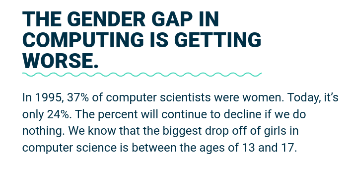

<Admonition variant="info">
### What is Spotlight of the Week?

As we know, _Empowered Women Empower Women_. I plan to live out this mantra by amplifying one of my favorite things: women making their mark in tech. My goal each week is to highlight women I look up to, organizations I support, and general knowledge that I find interesting that pertains to this topic. Please reach out if you have an idea to share, a resource I don't know about yet, or any questions you have relating to any of these spotlights.
</Admonition>

## Girls Who Code

Happy 10th Birthday to _Girls Who Code_! I came across [Reshma's](https://www.linkedin.com/in/reshma-saujani) LinkedIn post and again was mesmerized by the awesome women involved with this mission.

<iframe src="https://www.linkedin.com/embed/feed/update/urn:li:share:6914701488933990400" height="836" width="504" frameBorder="0" allowFullScreen title="Embedded post"></iframe>

So, because I am curious about all things, I spent the afternoon getting lost on the [Girls Who Code Website](https://girlswhocode.com/) and loved what I saw. Thinking I could spread the word and connect those who could benefit from this organization, I then saw this statistic.

 [^1]
[^1]: Original image source can be found [here](https://girlswhocode.com/about-us).

Alright, you caught me bystanding. That's ridiculous. Now I'm mad, and I'm going to get involved.

### How To Volunteer

For personal interest, I emailed the GWC team (big shoutout to Omayra for all the detailed info) and am sharing the response I got back for those who want to take the next steps. I personally hope to get involved with UTD's College Loop Chapter in the future!

1.  Connect with a [College Loops Chapter](https://girlswhocode.com/programs/college-loops): College Loops are programs at 2- and 4-year universities designed to help our alumni succeed and build community with other women in tech. These are founded and run by college students themselves, though they are always interested in connecting with working professionals to feature as guest speakers or involve in some other way. Our website's [locations page](https://girlswhocode.com/locations) allows you to find a College Loop in the area and will provide you with the Loop President's email to get in touch.
2.  Facilitate a [Girls Who Code Club](https://girlswhocode.com/programs/clubs-program): The majority of our programming is located at Clubs hosted by non-profits throughout the country. GWC Clubs are free after school programs for 3rd-12th grade girls to explore coding in a fun & friendly environment. You can search for an existing Club near you on our [website](https://girlswhocode.com/locations) to get in touch with a Facilitator seeking additional volunteers. Or if you are over the age of 18 and would like to start your own Club to volunteer with, check out our resources on how to start a Club at our [Knowledge Base](https://girlswhocode.zendesk.com/hc/en-us/sections/115001670767-Starting-a-Club). When you're ready to apply, access our Club Application [here](https://hq.girlswhocode.com/login?showTab=signup&redirect=/gwc-club-application).
3.  Share [Code at Home](https://girlswhocode.com/programs/code-at-home): Code at Home is our series of free computer science activities for students, educators, and parents to complete in the comfort of their own home, or in a one-off setting. Some activities are online, some offline, with varying levels of difficulty -- and each activity features a woman in tech who pioneered innovative technology. Because the activities are short and individualized, we've found leading a 1-day Code at Home workshop is a great way to spark interest with beginners.
4.  (Non-volunteer, paid, part-time) Work as a [Summer Immersion Program](https://girlswhocode.com/programs/summer-immersion-program) (SIP) Teacher or TA: Our introductory CS course for current 9th - 11th graders (rising high school sophomore, junior and senior girls and non-binary students) has closed for summer 2021. If you would be interested in part-time seasonal employment during SIP, please check back in Spring 2022 during our hiring period. We post all available opportunities on the job listings page of our website [here](https://jobs.lever.co/girlswhocode).
