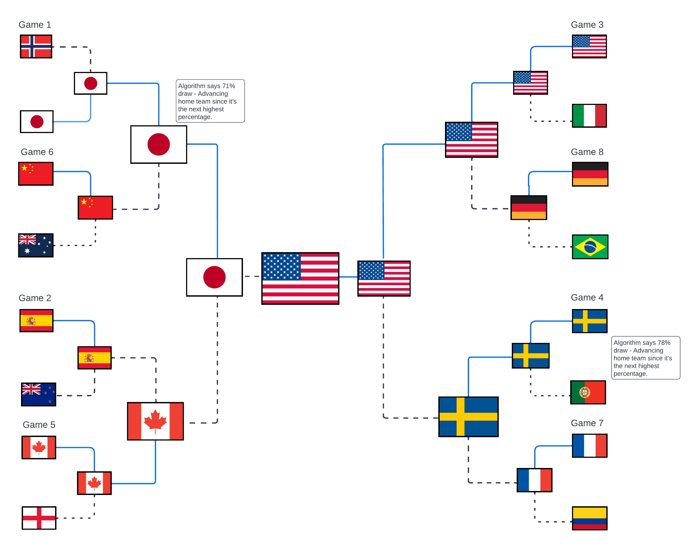
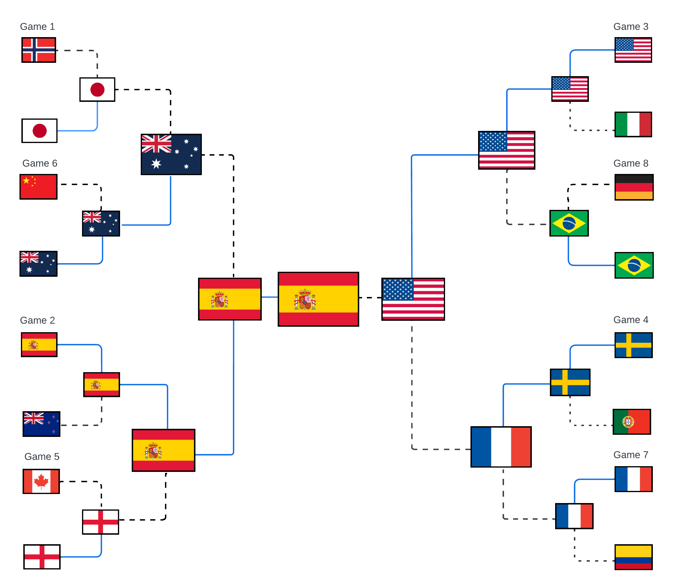

## Once upon a time

Once upon a time there was a girl who played soccer. She played so much soccer that after years and years of playing, she now has a couple of D3 records to her name. While I am now a fully retired, washed up fan who strictly spectates - I still love the game, and I still love watching anytime that I can. It doesn't hurt that I live in the United States, where we have arguably the best women's soccer program in the world, so of course it's fun to watch - especially international competitions. Because of my sports background, I also have my own opinions about men's and women's equality in sports, but I think one thing we can all agree upon is raising awareness for the incredible women's athletes who are out there playing today. As a data girl living in a data world, I thought what better way to do that than to pit myself against a machine learning algorithm to see who wins. I'm not going to lie, I am nervous for the outcome. I made my predictions like how I make all my decisions, on blind gut instinct, so I am definitely feeling vulnerable about sharing my decision making with the entire world. But, I am also excited to see what the outcome is. I have predicted the entire bracket, so I will be checking back in often to view my results. If both brackets are too terrible by the time we get to the Round of 16, I may redo the predictions, so stay tuned for that.

A quick note as you continue on - all the sports takes are my own, and do not reflect the opinions of my family, friends, dog, or employer.

## The project premise and scope

My initial inspiration was born out of me trying to find new data for one of my example projects with Starburst. I started researching, and I found a men's world cup analysis performed by [Gustavo Santos](https://gustavorsantos.medium.com/predicting-results-and-goals-with-machine-learning-599e99d6e3e0). Gustavo created a tremendous project that I highly recommend checking out. I was able to essentially streamline my own analysis from his prior work, so I want to say a major thank you to him. I also want to give credit where credit is due - I really learned so much from his analysis, and could not have replicated it on the women's side without his prior work. That was my entire goal of this project - to push myself out of my comfort zone and give the women's side some love by completing a simplified analysis from what Gustavo provided to share with the community. My husband always reminds me of the importance of reproducibility within our field, so I hope that this project will be a good example of that concept as well.

I plan to write a four part article series around this - The Introduction, The Data Wrangling, The Analysis, and The Result. This is the first part of that series, and I will link to the other parts as I publish them.

## The Data Wrangling

Every project starts with the data wrangling. I found [this](https://www.kaggle.com/datasets/martj42/womens-international-football-results?select=results.csv) Kaggle dataset, which was a great starting point. It records the outcome history of women's international football matches since before the historic 1991 World Cup, which to most is when women's soccer actually began. I did some initial data exploration, and then did some data cleaning to only take into account data from the last 20 years. I picked 20 years exactly because starting in 2003 there have been 6 women's world cups, and if Kristine Lilly can play on the national team for 23 years, I think this choice was a good balance between recency and history. I also filtered the data to only consider countries that were in the world cup. While it would be interesting to do a version two that takes into account all of the countries, the reality is that most of the best countries in the world are in the tournament. I thought that leaving the other countries in would skew the data too much, and I wanted to keep the analysis as clean as possible. I also needed to update the dataset, since it did not reflect all the results of international matches within the last year. You can't be in data without having to do some sort of manual reconciliation at some point. I feel like many of us in this field have the Marie Kondo attitude and kinda secretly love the mess that is data. Nevertheless, I persisted, and I was able to get the data into a format that I could then utilize for my analysis. I have included the wrangled data only in my project, but I am happy to share the entire datasets and process with anyone who is interested.

## The Analysis

I will dive into an analysis of the data in my second post, but for now I wanted to share the basic premise. I used the CatBoost algorithm to create my predictive analysis. The [train model notebook](https://github.com/monimiller/womens_wc_23/blob/main/notebooks/train_model.ipynb) is where I ran the analysis to create my model. Much of this was me simplifying Gustavo's previous work and tailoring it to my needs, but I did end up making some significant logic changes, like weighting every match equally. Instead of the home team being weighted differently than the away team, those outcomes were statistically equally probable. My run predictions notebook is where I then used the trained model to produce probabilities for all the results. If you are looking to recreate the analysis with the same model, all you need to do is run the second notebook. Based on the group play predictions, I then ran through all the playoff games and built out the full predictive bracket.

### The Predicted Bracket

## The Result

I am extremely interested to see these results because the algorithm and I both predicted very similar results in the group stage. Our analysis starts to differ as we move into the round of 16, and that's because I'm a human who made all my decisions after the application of my own biases. I mean a third world cup in a row win, in this field of competition? I'd be ecstatic as a USWNT fan, but I'm not sure the odds are ever in our favor. This is where I hope the algorithm is right, and I am wrong. I would love to see the three-peat happen.

I wish I would have had more time to research the other teams for my own predictions, but I didn't, I only know what I know. I am sensing that Australia and Spain are both hot, so hoping those two countries have a successful result as well.

### Monica's bracket

I will check back throughout the tournament to see who's winning - Me or the Algorithm. I will also be posting my results on [LinkedIn](https://www.linkedin.com/in/monimiller/) so feel free to follow along there as well.
